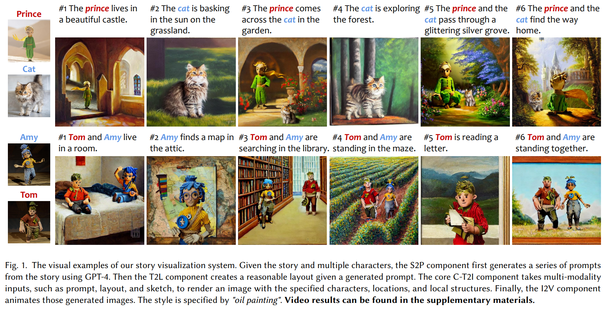

## <b> TaleCrafter : Interactive Story Visualization with Multiple Characters</b>

[Yuan Gong](https://github.com/yuanygong), Youxin Pang, [Xiaodong Cun](http://vinthony.github.io/), Menghan Xia, Haoxin Chen, Longyue Wang, [Yong Zhang](https://yzhang2016.github.io), [Xintao Wang](https://xinntao.github.io/), [Ying Shan](https://scholar.google.com/citations?hl=zh-CN&user=4oXBp9UAAAAJ), Ying Shan and Yujiu Yang

<!-- <table class="center">
<td></td>
<td></td>
<td></td>
</table > -->

  

## 🎏 Abstract
<b>TL; DR: TaleCrafter is an interactive story visualization tool that support multiple characters.</b>

<!-- 

CLICK for the full abstract
 -->

> Accurate Story visualization requires several necessary elements, such as identity consistency across frames, the alignment between plain text and visual content, and a reasonable layout of objects in images. Most previous works endeavor to meet these requirements by fitting a text-to-image (T2I) model on a set of videos in the same style and with the same characters, \textit{e.g.,} the FlintstonesSV dataset. However, the learned T2I models typically struggle to adapt to new characters, scenes, and styles, and often lack the flexibility to revise the layout of the synthesized images.
This paper proposes a system for generic interactive story visualization, capable of handling multiple novel characters and supporting the editing of layout and local structure. It is developed by leveraging the prior knowledge of large language and T2I models, trained on massive corpora. The system comprises four interconnected components: story-to-prompt generation (S2P), text-to-layout generation (T2L), controllable text-to-image generation (C-T2I), and image-to-video animation (I2V). First, the S2P module converts concise story information into detailed prompts required for subsequent stages. Next, T2L generates diverse and reasonable layouts based on the prompts, offering users the ability to adjust and refine the layout to their preference. The core component, C-T2I, enables the creation of images guided by layouts, sketches, and actor-specific identifiers to maintain consistency and detail across visualizations. Finally, I2V enriches the visualization process by animating the generated images.
Extensive experiments and a user study are conducted to validate the effectiveness and flexibility of interactive editing of the proposed system.
<!-- 
 -->

## ⚔️ Overview

  

The pipeline of our interactive story visualization system. The system comprises four components. (a) Story-to-prompt (S2P): a large language model is utilized to bridge the gap between the literary and artistic descriptions and the descriptions fed into T2I models. 
It comprehends the content in the given story and converts it into prompts suitable for T2I models, following the given instructions. 
(b) Text-to-layout (T2L): generates a reasonable layout for the main subjects in the prompt. 
(c) Controllable text-to-image (C-T2I): given various conditions such as prompt, layout, sketch, and a few images of each character, generates consistent-character images. It enables interactive editing of character, layout, and local structure through sketches. 
(d) Image-to-video (I2V): extracts depth from the image and converts it into a video by setting the camera path for novel view synthesis.

## 🌰 Examples

  

  

  

## 📀 Demo Video

  

